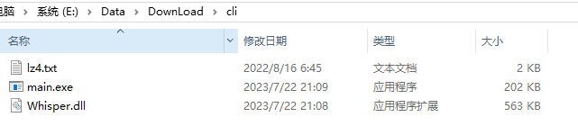

# code_inclde

* cli:  [Whisper语音转文字](https://github.com/Const-me/Whisper/releases/tag/1.12.0) 下载cli解压即可，cli是命令行模式，WhisperDesktop是桌面版

解压后长这样：

* src: 主要源码

* resource: 样式文件，及其默认图标，logo

* build.bat: CMake编译脚本， 运行前需打开确认或配置相关

# 界面

# Windows编译:

* 方式1(推荐)：
	双击build.bat，再输入 0/1(Debug/Release版本)； 构建vs项目并编译，最后复制依赖库。
	即通过 build.bat 可直接得到release包, 但需要先配置build.bat中相关路径
	
* 方式2： 
	通过QtCreator打开 src目录中.pro项目文件，构建编译运行，但需要手动复制resource 到exe所在路径，
	且依赖库需要手动执行： C:\Qt\Qt5.14.2\5.14.2\msvc2017\bin\windeployqt.exe  MyMusicPlayer.exe 
	
# 其他说明：

* cli: 语音转转文字，如果不要该模块则不带歌词的音乐无法加载出来

* 播放失败解决方案：
	可能原因：QT使用windows默认解码器，如果没有安装有相关DirectShowService解码器，则运行程序也是没法播放视频的，
	解决方法：装相关[directshow解码器](https://github.com/Nevcairiel/LAVFilters/releases)